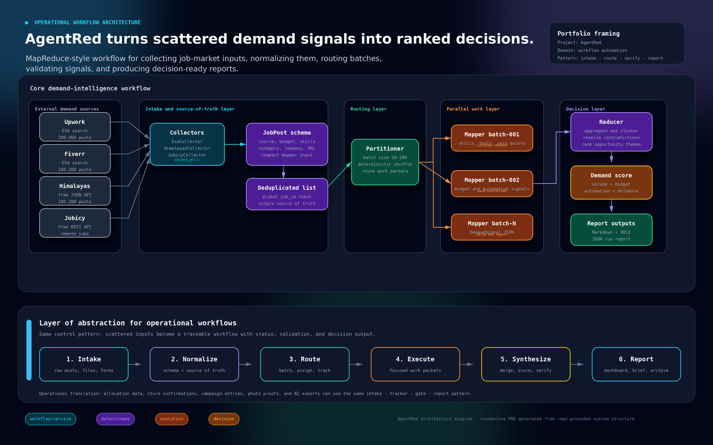

# AgentRed

> Agentic Reduce: MapReduce-style parallel AI agents for job market demand intelligence.

AgentRed scrapes job postings from multiple platforms, splits them into batches, processes each batch with a parallel AI mapper agent, then merges all results through a reducer agent into a ranked "what to build" opportunity report.

## Architecture



## How It Works

```
Job Posts (700+)
    │
    ├── Upwork (EXA API)
    ├── Fiverr (EXA API)
    ├── Himalayas (free API)
    └── Jobicy (free API)
    │
    ▼
┌─────────────┐
│  PARTITION   │  Split into batches of ~50 posts, shuffled across sources
└──────┬──────┘
       │
       ▼
┌─────────────┐  ┌─────────────┐  ┌─────────────┐
│  MAPPER 1   │  │  MAPPER 2   │  │  MAPPER N   │  Each agent independently
│  Batch A    │  │  Batch B    │  │  Batch C    │  extracts demand signals:
│             │  │             │  │             │  skills, tools, pain points,
└──────┬──────┘  └──────┬──────┘  └──────┬──────┘  automation potential, budgets
       │                │                │
       └────────────────┼────────────────┘
                        │  barrier sync
                        ▼
              ┌─────────────────┐
              │    REDUCER      │  Clusters signals, resolves conflicts,
              │                 │  ranks opportunities by demand score
              └────────┬────────┘
                       │
                       ▼
              ┌─────────────────┐
              │    REPORT       │  Markdown + DOCX + JSON
              │                 │  Ranked opportunities with evidence
              └─────────────────┘
```

## Why Agentic MapReduce?

Traditional market research is sequential: one analyst reads everything, loses context, and produces a report. AgentRed applies the MapReduce paradigm:

- **Map**: Each mapper agent gets an isolated context window and a structured brief. It sees only its batch of job posts, preventing context cross-contamination.
- **Reduce**: The reducer agent merges all mapper outputs, clusters related signals, and ranks opportunities.

This scales horizontally: more job posts = more mappers, not longer context windows.

## Quick Start

```bash
# Clone and install
git clone https://github.com/ramdhanhdy/agentred.git
cd agentred
pip install -e .

# Collect only (no LLM needed, saves to JSON)
agentred collect --output output/

# Full pipeline: collect + map + reduce + report
agentred run \
  --provider opencode-go \
  --model minimax/minimax-m3 \
  --output output/ \
  --format both
```

## Installation

```bash
# Clone the repo
git clone https://github.com/ramdhanhdy/agentred.git
cd agentred

# Basic install (collection + markdown reports)
pip install -e .

# With DOCX support
pip install -e ".[report]"

# With dev dependencies (tests)
pip install -e ".[dev]"
```

> **Note:** AgentRed is not published on PyPI. Install directly from the GitHub repository as shown above.

## Configuration

### Environment Variables

| Variable | Required | Used For |
|----------|----------|----------|
| `EXA_API_KEY` | Recommended | Upwork + Fiverr collection via EXA search |
| `OPENCODE_GO_API_KEY` | If using opencode-go provider | LLM calls via OpenCode Go gateway |
| `OPENROUTER_API_KEY` | If using openrouter provider | LLM calls via OpenRouter |
| `DEEPSEEK_API_KEY` | If using deepseek provider | LLM calls via DeepSeek |
| `GLM_API_KEY` | If using zai provider | LLM calls via Z.AI/GLM |
| `LONGCAT_API_KEY` | If using longcat provider | LLM calls via LongCat |

### Supported LLM Providers

| Provider | Models | Base URL |
|----------|--------|----------|
| `opencode-go` (default) | minimax-m3, qwen3.7-max, mimo-v2.5-pro, and 300+ more | opencode.ai/zen/go/v1 |
| `openrouter` | Same as above | openrouter.ai/api/v1 |
| `deepseek` | deepseek-v4-pro, deepseek-v4-flash | api.deepseek.com/v1 |
| `zai` | glm-5.2, glm-5.1, glm-5, glm-4.7 | api.z.ai/api/paas/v4 |
| `longcat` | LongCat-2.0 | api.longcat.chat/openai |

## Data Sources

| Source | API | Auth | Typical Volume |
|--------|-----|------|----------------|
| Upwork | EXA search | `EXA_API_KEY` | 200-400 posts |
| Fiverr | EXA search | `EXA_API_KEY` | 100-200 posts |
| Himalayas | Free JSON API | None | 100-200 posts |
| Jobicy | Free REST API | None | 100 posts |

A single run typically collects 500-800 unique job posts after deduplication.

## CLI Reference

```bash
# Full pipeline
agentred run \
  --provider opencode-go \
  --model minimax/minimax-m3 \
  --output reports/ \
  --format both \
  --batch-size 50

# Collection only (no LLM)
agentred collect --output collected/

# Skip specific sources
agentred run --model ... --no-exa --no-jobicy

# Use a different model per run
agentred run --provider opencode-go --model qwen/qwen3.7-max
```

## Architecture

```
agentred/
├── agentred/
│   ├── __init__.py
│   ├── cli.py              # Click-based CLI
│   ├── orchestrator.py     # Pipeline coordinator
│   ├── schemas/            # Pydantic models
│   │   └── __init__.py     # JobPost, DemandSignal, Opportunity, etc.
│   ├── collect/            # Data collection layer
│   │   ├── __init__.py
│   │   ├── base.py         # BaseCollector + budget/skill parsing
│   │   ├── exa.py          # EXA-powered Upwork + Fiverr
│   │   ├── himalayas.py    # Himalayas free API
│   │   └── jobicy.py       # Jobicy free API
│   ├── map/                # Map phase
│   │   ├── __init__.py
│   │   ├── partitioner.py  # Batch splitting
│   │   └── mapper.py       # Mapper prompt + response parsing
│   ├── reduce/             # Reduce phase
│   │   ├── __init__.py
│   │   └── reducer.py      # Reducer prompt + clustering
│   └── report/             # Output generation
│       ├── __init__.py
│       └── generator.py    # Markdown + DOCX
├── tests/
│   ├── test_schemas.py     # Budget parsing, model validation
│   ├── test_mapreduce.py   # Partitioning, mapper I/O
│   └── test_report.py      # Report generation
├── pyproject.toml
├── LICENSE
└── README.md
```

## Programmatic Usage

```python
from agentred.orchestrator import collect_all, run_mapreduce
from agentred.report import generate_markdown

# 1. Collect
posts = collect_all(use_exa=True, use_himalayas=True, use_jobicy=True)

# 2. MapReduce with any LLM
def my_llm(system_prompt: str, user_prompt: str) -> str:
    # Call your LLM here
    ...

map_results, report = run_mapreduce(posts, llm_call=my_llm)

# 3. Report
markdown = generate_markdown(report)
print(markdown)
```

## How Demand Scoring Works

Each opportunity is scored 0-100 based on:

| Factor | Weight | What it measures |
|--------|--------|-----------------|
| Demand volume | 35% | How many job posts mention the skill/tool |
| Budget signal | 25% | Are clients paying well? |
| Automation potential | 25% | How much of the task is AI-automatable? |
| Evidence quality | 15% | How many independent sources confirm this? |

## Use Cases

- **Founders**: Discover what to build based on real market demand
- **Freelancers**: Identify high-demand skills and niches
- **Researchers**: Track skill trends and market shifts
- **Investors**: Spot emerging automation opportunities

## Development

```bash
# Clone and install dev dependencies
git clone https://github.com/ramdhanhdy/agentred.git
cd agentred
pip install -e ".[dev]"

# Run tests
pytest tests/ -v

# Run with coverage
pytest tests/ --cov=agentred --cov-report=term-missing
```

## License

MIT
